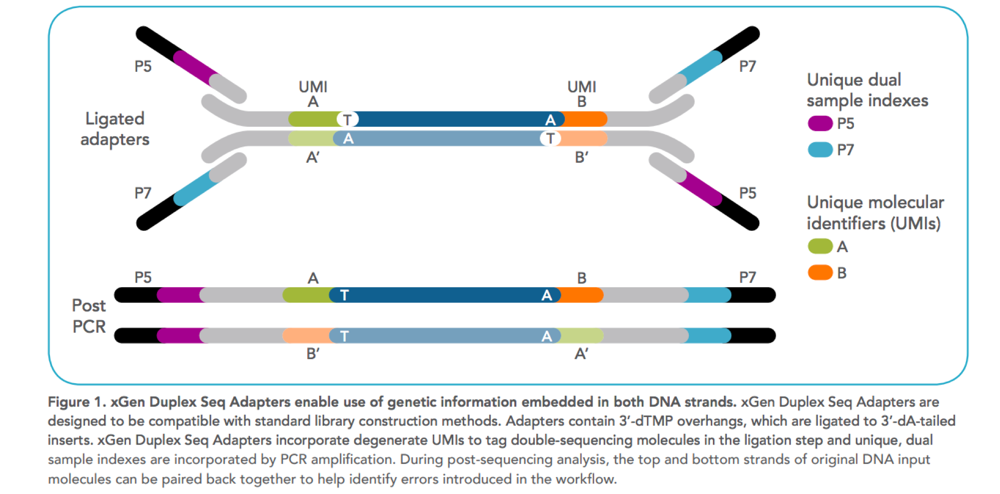
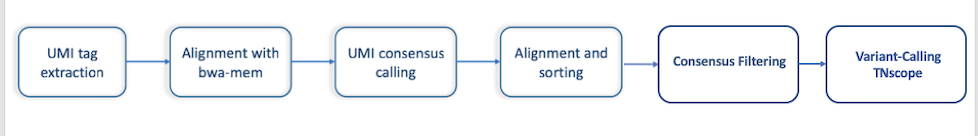
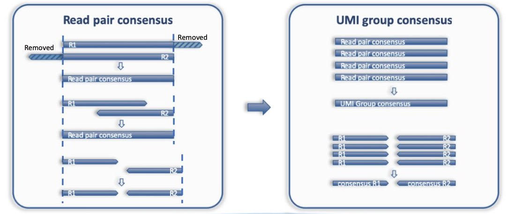
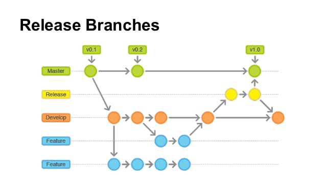

=================================
Frequently Asked Questions (FAQs)
=================================

**BALSAMIC**
^^^^^^^^^^^^^^^^^^^^^^^^^^^^^^^^

**UMIworkflow**
^^^^^^^^^^^^^^^^^^^^^^^^^^^^^^^^

**What are UMIs**

- Unique Molecular Identifiers (UMIs) are short random nucleotide sequences (3-20 bases) that are ligated to the ends of DNA fragments prior to sequencing to greatly reduce the impact of PCR duplicates and sequencing errors on the variant calling process.

    Figure1: Design of UMI adapters in the library preparation. Ref_ 

.. _Ref: https://plone.bcgsc.ca/services/solseq/duplex-umi-documents/idt_analysisguideline_varcall-umis-dupseqadapters/

__ Ref_

**How is the UMIworkflow implemented**

- CG's UMIworkflow is implemented using the commercial software Sentieon. The Sentieon tools provide functionality for extracting UMI tags from fastq reads and performing barcode-aware consensus generation. The workflow is as described:

    Figure2: UMI workflow steps.

**How is the UMI structure defined**

Our pair-end sequencing read length is about 151 bp and the UMI structure is defined as`3M2S146T, 3M2S146T` where `3M` represents 3 UMI bases, `2S` represents 2 skipped bases,  `146T` represents 146 bases in the read.

**Are there any differences in the UMI read extraction if the read structure is defined as `3M2S146T, 3M2S146T` or `3M2S+T, 3M2S+T`?**

In theory, this should be the same if the read length is always 151bp. But the recommendation is to use `3M2S+T, 3M2S+T` so that UMIworkflow can handle any unexpected input data.

**How does the `umi extract` tool handle sequencing adapters?  Do the input reads always need to be adapter removed fastq reads**

The presence of 5' adapter sequences can cause issues for the Sentieon `umi extract` tool, as the extract tool will not correctly identify the UMI sequence. If 5' adapter contamination is found in the data, before processing with the `umi extract` tool, these adapter sequences needed to be removed with a third-party trimming tool. 
3' adapter contamination is much more common and can occur when the insert size is shorter than the sequence read length. The Sentieon `umi consensus` tool will correctly identify and handle 3' adapter/barcode contamination during consensus read creation.

**How does Sentieon `umi consensus` tool handles paired-end reads**

The `umi consensus` tool will merge overlapping read pairs when it can, but it is not possible for reads with an insert size greater than 2x the read length as there is some unknown intervening sequence. In this case, `umi consensus` will output a consensus read pair where each consensus read in the pair is constructed separately, while other reads in the dataset are collapsed/merged to single-end reads.

    Figure3: Figure taken from Sentieon document. 

**Purpose of consensus-filtering step in the UMIworkflow**

Mainly to reduce the calling of false-positive variants. Consensus filtering is based on the setting of minimum raw reads (MinR) supporting each UMI group.  By default, `MinR` is set as 3,1,1, meaning that the minimum number of raw reads in both strands should be greater than 1 and the sum of both strands is greater than 3.   The default `3,1,1` is a good starting point at lower coverages. This setting can be further adjusted accordingly at higher coverages or if finding false-positive calls due to consensus reads with little read support.

**How is the performance of other variant callers for analysing UMI datasets**
UMI workflow is validated with two datasets (SeraCare and HapMap). The Vardict failed to call the true reference variants while the TNscope performed better. A more detailed analysis is summarized here_. 

.. _here: https://drive.google.com/file/d/1Y1kNPE5u9VvykjmNhG4RydVMUyezbqh5/view?usp=sharing

We are still investigating other UMI-aware variant callers and maybe in the future, if something works better, additional varcallers will be added to the UMIworkflow.

**Git Related Questions**
^^^^^^^^^^^^^^^^^^^^^^^^^^^^^^^^

**How to make a new release of balsamic**

Here is the release model look like:

*Requirements:* bumpversion

`pip install bumpversion`

If changes are hotfixes/patches, make a release from master.
Else make a release from develop.

If decided to make a release version is from `develop`, do the following to release a balsamic new version:

1. `git checkout master && git pull`
1. `git checkout develop`
1. `git merge master`
1.  Fix all possible conflicts and `git push`
1. `git checkout -B release_X.X.X`
1. Change X.X.X version of the release in the CHANGELOG.rst

Make a pull request to master at this point. After pull request is approved and merged into master:
1. `git checkout master`
1. `git pull`
1. `bumpversion --verbose [major/minor/patch]`
1. `git push`
1. `git push --tags`
