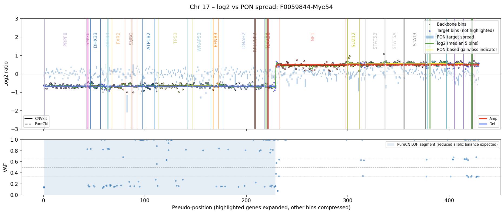

CNV Report Documentation
========================

Overview
--------

The CNV report provides a comprehensive overview of copy number variation (CNV)
signals derived from CNVkit and (optionally) PureCN, together with quality
metrics and visualization.

The report consists of:

- Genome-wide CNV plots (from CNVkit)
- Per-chromosome CNV and VAF plots
- Segment-level table (CNVkit and PureCN)
- Gene-region level table
- Quality control metrics
- Optional PON-based (Panel of Normals) interpretation

Input Data
----------

The report is generated from the following main inputs:

- CNVkit bin-level data (``.cnr``)
- CNVkit segment-level data (``.cns``)
- CNVkit initial segments (``.cns``)
- Germline VCF (for VAF visualization)
- Cancer-associated genes list
- Cytoband annotation
- Panel of Normals (PON) (``.cnn``) [Optional]
- PureCN LOH/segment output [Optional]
- Purity/ploidy summary [Optional]

Chromosome Plots
----------------

Each chromosome plot consists of two panels:

Top panel (CNV signal)
^^^^^^^^^^^^^^^^^^^^^^

This panel shows:

- Individual bins (log2 ratios)
- Smoothed log2 signal. Calculated using a sliding window median (5-bin window)
- CNV segments: CNVkit results are shown as solid lines, while PureCN results appear as dashed lines. Segments are colored red for amplifications, blue for deletions, and black for neutral regions
- PON-derived signals (if PON is available). Shown as a band representing expected variation across normal samples.
- Highlighted genes: Cancer-associated genes are labeled and colored.

Bottom panel (VAF)
^^^^^^^^^^^^^^^^^^^^^^^^^^^^^^^^^^^^^^

This panel shows:

- Variant allele frequencies (VAF)
- Expected reference lines: 0.5 (heterozygous); 1/3 and 2/3 (imbalance)
- LOH regions are shown as shaded areas when PureCN results are available

Interpretation:

- Tight clustering around 0.5 → balanced alleles
- Split or shifted clusters → allelic imbalance
- Flattening toward 0 or 1 → possible LOH

Gene highlighting
-----------------

Genes are highlighted in chromosome plots to emphasize biologically and clinically relevant regions. Highlighted genes are visually expanded to improve readability.

**Panel analysis:**

In panel-based analyses, genes are highlighted if they meet at least one of the following criteria:

- Presence of CNV signal (amplification/deletion) or LOH when genes have >2 overlapping targets (probes in the panel design)
- Cancer-associated genes with >2 overlapping targets

**Exome analysis:**

In exome analyses (``--is-exome`` is enabled), only cancer-associated genes are highlighted, provided they have more than two overlapping targets.

Cancer associated genes
-----------------------

A predefined list determines which genes are considered cancer-associated and prioritized in the report.

This list combines:

- Cancer genes from OncoKB
- Additional clinically relevant genes

.. note::

   If there is a gene that you expect to see highlighted in the report but is not included,
   you can request its addition to the cancer gene list.

   Please open an issue in the BALSAMIC repository or contact the maintainers by email.

   Including a short justification (e.g. clinical relevance or panel design) helps ensure
   the request can be evaluated and incorporated quickly.

Gene regions
------------

Gene regions represent aggregated signals across bins belonging to a gene.

Creation steps
^^^^^^^^^^^^^^

1. Bins are grouped per gene
2. Bins are ordered by genomic position
3. Adjacent bins are merged into candidate runs
4. Runs are filtered based on signal strength
5. Small gaps may be bridged if signal is consistent
6. Final regions are collapsed into summary rows

.. note::

   If there is no PON available, the bins of a gene are simply collapsed, and annotated with overlapping CNVkit segment information.

Each region includes:

- Genomic span (start/end)
- Number of targets
- Mean log2 signal

PON-based interpretation
-----------------------

When a Panel of Normals (PON) is provided, additional metrics are computed.

These include:

- PON mean log2 per region
- PON spread (expected noise)
- Z-score-like signal strength

PON signal classification:

- ``strong``: strong deviation from normal (score > 5.0)
- ``borderline``: mild deviation ( 5.0 < score > 2.0)
- ``noise``: no significant deviation (score =< 2.0)

PON indication:

- ``GAIN``: likely amplification ((mean_log2 - mean_log2_pon) > 0.07)
- ``LOSS``: likely deletion ((mean_log2 - mean_log2_pon) < -0.07)

.. note::

   Only "strong" signals are classified as GAIN / LOSS, otherwise, gene-region is set to NEUTRAL

   Only genes with a minimum of 8 targets will be considered for this PON based GAIN / LOSS indication

Important:

- PON interpretation is only available if a PON file is provided

Segment table
-------------

The segment table combines CNVkit and PureCN results.

Columns include:

- Chromosome and genomic coordinates
- Segment size
- CNVkit log2 and copy number
- PureCN copy number and LOH annotations
- Cytoband
- Genes in segment (see note below!)

CNV calls are standardized:

- Amplification
- Deletion
- Neutral

.. note::

   Only genes with a minimum of 2 targets are shown in the segment table

   For **exome** this is further limited to only show cancer-associated genes

Sex-aware interpretation
^^^^^^^^^^^^^^^^^^^^^^^^

Copy number interpretation accounts for sex chromosomes:

- X and Y are interpreted differently depending on sample sex
- Prevents misclassification of normal sex chromosome states

Gene region table
-----------------

The gene-region table summarizes CNV signals at gene level.

Includes:

- Gene name
- Number of targets
- Mean log2
- CNVkit and PureCN calls
- PON-based metrics (if available)

This table is useful for:

- Seeing indications for focal amplifications/deletions that may be missed by Cnvkit or PureCN

.. warning::

   The gene-region analysis is based on a custom aggregation method and has not
   been formally validated for clinical use.

   The signals shown here should be interpreted as **supportive evidence only**
   and must not be used as standalone or definitive CNV calls.

   Any findings from this table should be confirmed using established CNV callers
   (e.g. CNVkit, PureCN) and/or orthogonal methods before being considered for
   clinical interpretation.

Quality metrics
---------------

The report includes summary QC metrics:

Log2 noise
^^^^^^^^^^

- Derived from adjacent bin differences
- Similar to CNVkit DLRSpread
- Lower values indicate cleaner signal

Filtered targets
^^^^^^^^^^^^^^^^

- Number of bins removed relative to PON
- Indicates how much of the original panel design could be used for CNV analysis

Limitations
-----------

- CNV detection depends on coverage quality and tumor purity
- Small focal events may be missed in low-coverage regions
- PON interpretation depends on quality and composition of normal samples
- LOH detection requires reliable PureCN results
