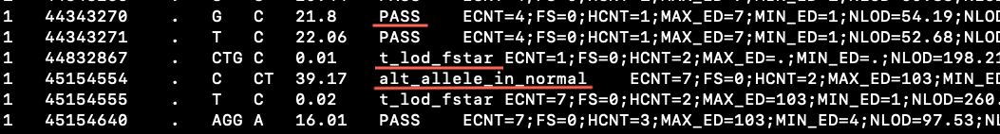

***********************************
BALSAMIC Variant Calling Algorithms
***********************************

In BALSAMIC, various bioinfo tools are integrated for reporting somatic and germline variants. Also, the choice of these tools differs between the type of analysis,
eg: `Target Genome Analysis (TGA)` or `Whole Genome Sequencing (WGS)`. Various filters (Pre-call and Post-call filtering) are applied at different levels to report high-confidence variant calls.

**Pre-call filtering** is where the variant-calling tool decides not to call a variant line to the VCF file if the default filters did not pass the criteria. The set of default filters differs between the various variant-calling algorithms.

To know more about the pre-call filters used by the variant callers, please have a look at the VCF header of the particular variant-calling results.
For example:

..  figure:: images/vcf_filters.png
    :width: 500px

    Pre-call filters applied by the `Vardict` variant-caller is listed in the VCF header.

In the VCF file, the `FILTER` status is `PASS` if this position has passed all filters, i.e., a call is made at this position. Otherwise,
if the site has not passed all filters, a semicolon-separated list of codes for filters that fail. e.g., `p8;pSTD` might
indicate that at this site, the mean position in reads is less than 8 and position in reads has a standard deviation of 0.

.. note::

    In BALSAMIC, this VCF file is named as `*.all.vcf.gz` (eg: `SNV.somatic.<CASE_ID>.vardict.all.vcf.gz`)

    Vardict Variant calls with different 'FILTER' status underlined in white line (`NM4.5`, `PASS`, `p8;pSTD`)

**Post-call filtering** is where a variant is further filtered with quality, depth, VAF, etc., with more stringent thresholds.

For `Post-call filtering`, in BALSAMIC we have applied various filtering criteria (`Vardict_filtering`_, `TNscope filtering (Tumor_normal)`_ ) depending on the analysis-type (TGS/WGS) and sample-type(tumor-only/tumor-normal).

.. important::
    In BALSAMIC, this VCF file is named as `*.all.filtered.pass.vcf.gz` (eg: `SNV.somatic.<CASE_ID>.vardict.all.filtered.pass.vcf.gz`)

**Targeted Genome Analysis**
#############################

Somatic Callers for reporting SNVs/INDELS
******************************************

**Vardict**
===========

`Vardict <https://github.com/AstraZeneca-NGS/VarDict>`_ is a sensitive variant caller used for both tumor-only and tumor-normal variant calling.
The results of `Vardict` variant calling are further post-filtered based on several criteria (`Vardict_filtering`_) to retrieve high-confidence variant calls.
These high-confidence variant calls are the final list of variants uploaded to Scout or available in the delivered VCF file in Caesar.

**Vardict_filtering**
^^^^^^^^^^^^^^^^^^^^^^
Following is the set of criteria applied for filtering vardict results. It is used for both tumor-normal and tumor-only samples.

*Mean Mapping Quality (MQ)*: Refers to the root mean square (RMS) mapping quality of all the reads spanning the given variant site.

::

    MQ >= 40

*Total Depth (DP)*: Refers to the overall read depth supporting the called variant.

::

    DP >= 100

*Variant depth (VD)*: Total reads supporting the ALT allele

::

    VD >= 5

*Allelic Frequency (AF)*: Fraction of the reads supporting the alternate allele

::

    Minimum AF >= 0.007
    Maximum AF < 1

.. attention::
    BALSAMIC <= v8.2.7 uses minimum AF 1% (0.01). From Balsamic v8.2.8, minimum VAF is changed to 0.7% (0.007)

*GNOMADAF_POPMAX*: Maximum Allele Frequency across populations

::

    GNOMADAF_popmax <= 0.005  (or) GNOMADAF_popmax == "."

.. important::
    Additionally, the variant is excluded for tumor-normal cases if marked as 'germline' in the `STATUS` column of the vcf file.

**Whole Genome Sequencing (WGS)**
**********************************

**Sentieon's TNscope**
=======================

BALSAMIC utilizes the `TNscope` algorithm for the variant calling of somatic SNV/INDELS in WGS samples.
The `TNscope <https://www.biorxiv.org/content/10.1101/250647v1.abstract>`_ algorithm performs the somatic variant calling on the tumor-normal or the tumor-only samples, using a Haplotyper algorithm.

**TNscope filtering (Tumor_normal)**
^^^^^^^^^^^^^^^^^^^^^^^^^^^^^^^^^^^^^
To the variants in TNscope raw vcf file `SNV.somatic.$CASE_ID.tnscope.all.vcf.gz`, the following filters are applied and those that scored as `PASS` are considered to the final vcf file `SNV.somatic.$CASE_ID.tnscope.all.filtered.pass.vcf.gz`.

*Total Depth (DP)*: Refers to the overall read depth from all target samples supporting the variant call

::

    DP(tumor) >= 10 (or) DP(normal) >= 10

*Allelic Depth (AD)*: Total reads supporting the ALT allele in the tumor sample

::

    AD(tumor) >= 3

*Allelic Frequency (AF)*: Fraction of the reads supporting the alternate allele

::

    Minimum AF(tumor) >= 0.05
    Maximum AF(tumor) < 1

*GNOMADAF_POPMAX*: Maximum Allele Frequency across populations

::

    GNOMADAF_popmax <= 0.001 (or) GNOMADAF_popmax == "."

**TNscope filtering (tumor_only)**
^^^^^^^^^^^^^^^^^^^^^^^^^^^^^^^^^^^
The variants in TNscope raw vcf file `SNV.somatic.$CASE_ID.tnscope.all.vcf.gz` are filtered for WGS interval regions; collected from gatk_bundles `<gs://gatk-legacy-bundles/b37/wgs_calling_regions.v1.interval_list>`_
and following filters are applied. The variants that scored as `PASS` are considered for `**Merging of TNscope and TNhaplotyper results (tumor_only)**`_

*Total Depth (DP)*: Refers to the overall read depth supporting the variant call

::

    DP(tumor) >= 10

*Allelic Depth (AD)*: Total reads supporting the ALT allele in the tumor sample

::

    AD(tumor) > 3

*Allelic Frequency (AF)*: Fraction of the reads supporting the alternate allele

::

    Minimum AF(tumor) > 0.05
    Maximum AF(tumor) < 1

*GNOMADAF_POPMAX*: Maximum Allele Frequency across populations

::

    GNOMADAF_popmax <= 0.001 (or) GNOMADAF_popmax == "."

*Normalized base quality scores*:  The sum of base quality scores for each allele (QSS) is divided by the allelic depth of alt and ref alleles (AD)

::

    SUM(QSS)/SUM(AD) >= 20

*Read Counts*: Count of reads in a given (F1R2, F2R1) pair orientation supporting the alternate allele and reference alleles

::

    ALT_F1R2 > 0, ALT_F2R1 > 0
    REF_F1R2 > 0, REF_F2R1 > 0

*SOR*: Symmetric Odds Ratio of 2x2 contingency table to detect strand bias

::

    SOR < 3

**TNhaplotyper filtering (tumor_only)**
^^^^^^^^^^^^^^^^^^^^^^^^^^^^^^^^^^^^^^^
The variants in TNhaplotyper raw vcf file `SNV.somatic.$CASE_ID.tnhaplotyper.all.vcf.gz` are filtered for WGS interval regions; collected from gatk_bundles `<gs://gatk-legacy-bundles/b37/wgs_calling_regions.v1.interval_list>`_
and the following filters are applied. The variants that scored as `PASS` are considered for `Merging of TNscope and TNhaplotyper results (tumor_only)`_

*Total Depth (DP)*: Refers to the overall read depth from all target samples supporting the variant call

::

    DP(tumor) >= 10 (or) DP(normal) >= 10

*Allelic Depth (AD)*: Total reads supporting the ALT allele in the tumor sample

::

    AD(tumor) >= 3

*Allelic Frequency (AF)*: Fraction of the reads supporting the alternate allele

::

    Minimum AF(tumor) >= 0.05
    Maximum AF(tumor) < 1

*GNOMADAF_POPMAX*: Maximum Allele Frequency across populations

::

    GNOMADAF_popmax <= 0.001 (or) GNOMADAF_popmax == "."

*Normalized base quality scores*:  The sum of base quality scores for each allele (QSS) is divided by the allelic depth of alt and ref alleles (AD)

::

    SUM(QSS)/SUM(AD) >= 20

*Read Counts*: Count of reads in a given (F1R2, F2R1) pair orientation supporting the alternate allele and reference alleles

::

    ALT_F1R2 > 0, ALT_F2R1 > 0
    REF_F1R2 > 0, REF_F2R1 > 0

**Merging of TNscope and TNhaplotyper results (tumor_only)**
^^^^^^^^^^^^^^^^^^^^^^^^^^^^^^^^^^^^^^^^^^^^^^^^^^^^^^^^^^^^^
For tumor-only samples, to reduce the number of reported somatic variants,
`TNscope filtering (tumor_only)`_ and `TNhaplotyper filtering (tumor_only)`_ results are merged using the `bcftools` intersect
functionality. Only those variants called by both callers are confidently reported as the final filtered list of variants (`SNV.somatic.{CASE_ID}.tnscope.all.filtered.pass.vcf.gz`).
This is the vcf file that is either uploaded to scout or delivered via caesar to the customer.

**Target Genome Analysis with UMI's into account**
**************************************************

**Sentieon's TNscope**
=======================
`UMI workflow <https://balsamic.readthedocs.io/en/latest/FAQs.html>`_ performs the variant calling of SNVs/INDELS using the `TNscope` algorithm from UMI consensus-called reads.
The following filter applies for both tumor-normal and tumor-only samples.

**Pre-call Filters**

*minreads*: Filtering of consensus called reads based on the minimum reads supporting each UMI tag group

::

    minreads = 3,1,1

It means that at least `3` UMI tag groups should be ideally considered from both DNA strands, where a minimum of at least `1` UMI tag group should exist in each of the single-stranded consensus reads.

*min_init_tumor_lod*: Log odds is the likelihood that the candidate mutation is real over the likelihood that the candidate mutation is a sequencing error before any read-based filters are applied.
Minimum log-odds for the candidate selection. TNscope default: `4`. In our UMI-workflow we reduced this setting to `0.5`

::

    min_init_tumor_lod = 0.5

*min_tumor_lod*: minimum log odds in the final call of variants. TNscope default: `6.3`. In our UMI-workflow we reduced this setting to `4.0`

::

    min_tumor_lod = 4.0

**Post-call Filters**

*GNOMADAF_POPMAX*: Maximum Allele Frequency across populations

::

    GNOMADAF_popmax <= 0.001 (or) GNOMADAF_popmax == "."
